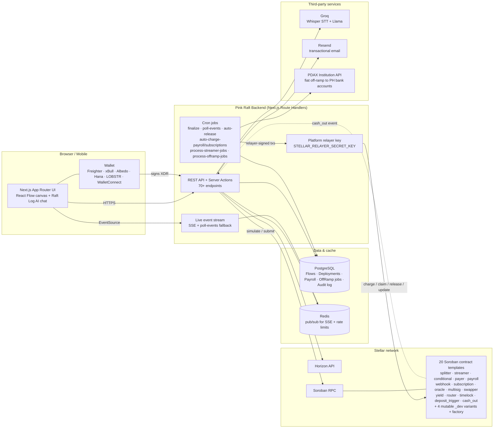
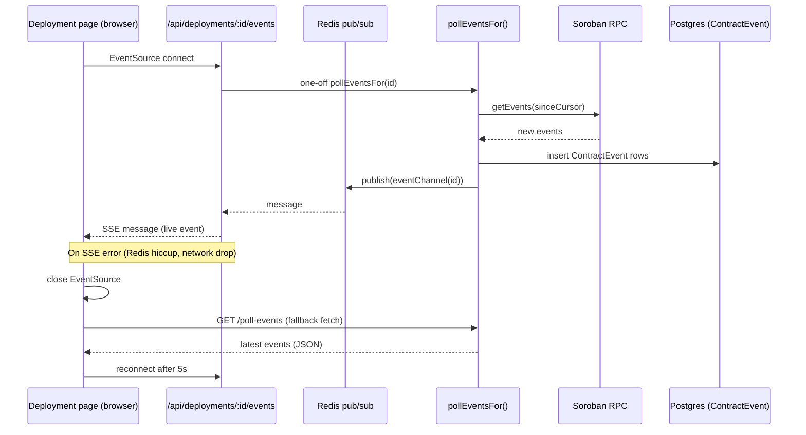
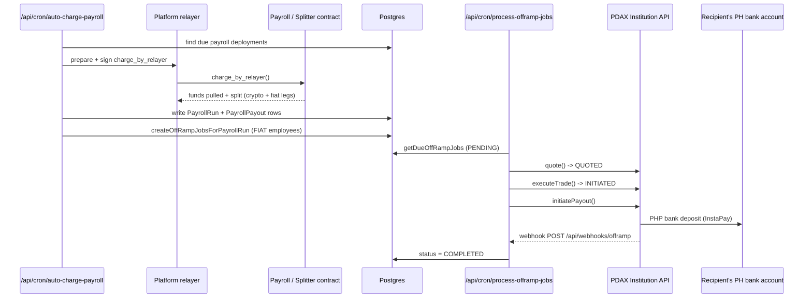
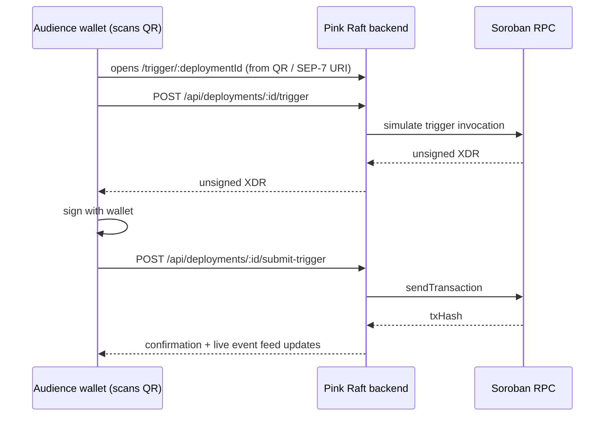

# Pink Raft

> **Zaps for money.** A non-custodial, no-code platform for building and deploying programmable payment workflows on Stellar.

Pink Raft is a non-custodial, no-code platform for building and deploying programmable payment workflows on Stellar. Instead of hiring a Rust engineer to write and audit a bespoke Soroban contract, or renting a closed-source payments SaaS that takes custody of the money, an operator drags triggers (`On Receive`, `On Schedule`, `Webhook`, `Oracle`), logic (`Condition`, `Router`, `Timelock`, `Multisig`), and actions (`Pay`, `Split`, `Stream`, `Swap`, `Payroll`, `Cash Out`) onto a visual canvas — optionally narrating the whole thing by voice to an AI assistant — and deploys the result as a chain of pre-audited, unit-tested Soroban contracts signed entirely from their own wallet. What started as a 3-template hackathon demo (splitter, streamer, conditional escrow) has grown into a **20-contract-template library** covering revenue splits, vesting, escrow, recurring subscriptions, full payroll runs, oracle/webhook triggers, and — critically for recipients who don't hold crypto — a production **fiat off-ramp**: a live integration with [PDAX](https://web.pdax.ph/) (a licensed Philippine digital-asset exchange) lets a payroll or remittance flow pay a crypto wallet and a Philippine bank account interchangeably, closing the loop from on-chain trigger to spendable pesos without the operator ever touching a banking API.

Every workflow built in Pink Raft is a real Soroban deployment, not a synthetic demo, so adoption translates directly into genuine Soroban contract volume, wallet activity (Freighter, xBull, Albedo, Hana, LOBSTR, and WalletConnect-compatible mobile wallets), and USDC throughput — live today on both Stellar testnet and mainnet. Because the contract templates are MIT-licensed and open source, they double as a public good any Soroban builder can fork outright, and the PDAX off-ramp bridge is one of the few production examples of a Stellar no-code tool completing the **full loop from on-chain trigger to real-world fiat delivery** — a concrete proof point for "programmable money you can actually spend" in a market (Philippine remittances, one of the largest corridors in the world) where that last-mile gap has historically been the adoption blocker.

|                 |                                                                                                          |
| --------------- | -------------------------------------------------------------------------------------------------------- |
| **Status**      | Live on mainnet — visual builder, 20 Soroban contract templates, payroll + fiat off-ramp, AI voice assistant, live event feed |
| **Live app**    | [pinkraft.xyz](https://pinkraft.xyz/) (mainnet) · [pinkraft.up.railway.app](https://pinkraft.up.railway.app/) (testnet staging) |
| **License**     | MIT                                                                                                        |

---

## Pitch deck

A 10-slide draft investor deck (MARP) lives at [`docs/pitch-deck.md`](docs/pitch-deck.md) — sized for a 3-minute pitch, themed to match [`BRAND.md`](BRAND.md).

```bash
# PDF
npx @marp-team/marp-cli docs/pitch-deck.md -o pitch-deck.pdf

# Live preview
npx @marp-team/marp-cli --preview docs/pitch-deck.md
```

Team names, raise size, and pricing tiers are placeholders — swap before sharing externally.

---

## System architecture



Non-custodial by design: the backend only ever **builds and simulates** Soroban transactions. Every user-initiated transaction is signed client-side by the user's own wallet — the one exception is the platform **relayer key**, a single scoped Stellar account used only for automated, time-based, or recurring on-chain actions (releasing a timelock, claiming vested streamer funds, charging a due subscription/payroll run) that the contract's own authorization rules explicitly permit a relayer to call. The relayer never moves funds outside what the deployed contract already allows.

### Sequence: deploy a flow

```mermaid
sequenceDiagram
    participant U as User (browser)
    participant W as Wallet
    participant B as Pink Raft backend
    participant RPC as Soroban RPC

    U->>B: POST /api/deployments/prepare (flow)
    B->>B: validateFlow() + flowToPipeline()
    B->>RPC: simulateTransaction (per contract in pipeline)
    RPC-->>B: simulation result
    B-->>U: unsigned XDR + pipeline preview
    U->>W: sign(xdr)
    W-->>U: signed XDR
    U->>B: POST /api/deployments/:id/submit (signedXdr)
    B->>RPC: sendTransaction
    RPC-->>B: txHash
    B->>B: status = SUBMITTED
    B->>RPC: poll getTransaction until SUCCESS
    RPC-->>B: SUCCESS
    B->>B: status = CONFIRMED; schedule streamer/claim jobs
    B-->>U: CONFIRMED + contractAddress
```

### Sequence: live event delivery (SSE primary, polling fallback)



### Sequence: payroll charge → fiat off-ramp (PDAX)



### Sequence: public QR trigger (audience-funded)



---

## 🧩 Problem

Every fintech, MSME, and SMB that wants **programmable payments** today has two options:

1. Hire a Rust developer who knows Soroban (rare, expensive, slow), or
2. Pick from off-the-shelf SaaS that locks them into someone else's rails and fees.

There's no middle layer — no Stripe Connect, no Zapier-for-money — that lets a non-technical operator wire up `"when this happens, send that"` and deploy it as their own on-chain contract. The result: programmable payouts stay out of reach of the people who actually need them (creators splitting revenue with collaborators, OFWs sending periodic remittances, MSMEs paying contractor pools and full payroll runs, household budgets fanning income across accounts). And even when the on-chain half works, the recipient is often left holding crypto they can't easily spend — the last-mile "off-ramp to fiat" problem that most Web3 payment tools leave to someone else.

## 🌟 Vision

Make programmable payments a **drag-and-drop primitive**, the way Zapier made cross-SaaS automation a drag-and-drop primitive a decade ago. Anyone who can sketch a flow on a whiteboard should be able to ship the same flow as a non-custodial Soroban contract — owning their keys, their funds, and their logic — in under 90 seconds, on a phone, without ever touching Rust or XDR. And when the recipient needs real money in a real bank account, Pink Raft should be able to close that loop too, not stop at the chain's edge.

Long-term, Pink Raft is the canonical "no-code Stellar surface": the layer between the chain's primitives (atomic transfers, Soroban host functions, SEP-7 deep links) and the operators who want to compose them into real-world money flows — with a direct bridge to fiat where the workflow demands it.

## 🎯 Purpose

Originally built for the **Stellar Hackathon 2026**, now live on Stellar mainnet.

We picked this problem because the Stellar Soroban toolchain is genuinely excellent for backend developers and genuinely opaque to everyone else. A library of pre-audited templates — now 20 contract crates spanning triggers, conditions, and actions — covers the long tail of real-world payment workflows; most "programmable payment" use cases reduce to composing a handful of them. By shipping them as visual blocks instead of Rust libraries, we put the chain's full power in the hands of the operators who have the use case but not the engineering team.

The mission: **make Stellar the easiest chain on which to ship a payment flow — and the easiest chain on which that flow ends in money someone can actually spend.**

## 👥 Target Users

- **Fintech product managers / founders** — need programmable payouts (revenue splits, partner programs, escrow), don't have a Rust team, won't accept being locked into a closed SaaS.
- **MSME / SMB operators** — running creator collabs, freelancer pools, supplier-payment fan-outs, or full payroll runs across a mixed crypto/fiat team. Want self-custody and audit-grade transparency without learning a new SDK.
- **OFWs and remittance senders** — periodic family payouts, automatic budget splits (rent + savings + spending) once funds land on-chain, with the option to land as pesos in a Philippine bank account rather than a wallet.
- **Non-technical operators on a phone** — the hero demo is "presenter drags 3 blocks on a phone, hits Deploy, audience scans QR, money moves in 5 seconds." If a flow can't ship from a phone, we haven't solved the problem.

## ✨ Features

- **Visual flow builder** — drag triggers, logic, and actions onto a `@xyflow/react` canvas, wire them up, validate, deploy. Mobile-responsive; the hero demo runs on a phone.
- **20 Soroban contract templates**, composable into multi-contract pipelines (see table below).
- **Non-custodial deploy** — the backend prepares simulated XDR; the user's wallet (Freighter / xBull / Albedo / Hana / LOBSTR / WalletConnect-compatible mobile wallets via `@creit.tech/stellar-wallets-kit`) signs. Private keys never touch the server.
- **QR-triggered execution** — every deployment renders a public trigger page and QR / dApp URL. Anyone with a wallet can scan it, sign, and fire the workflow — useful for audience-funded demos, public crowdpay flows, and self-fund-back tests. Rate-limited + audit-logged on the public endpoints.
- **Payroll** — recurring, relayer-charged payroll runs across a mixed roster of crypto-paid and fiat-paid employees, with per-employee bank details, allowance management, and a full admin panel (`components/payroll/*`).
- **Fiat off-ramp (PDAX)** — a production integration with the PDAX Institution API converts on-chain USDC to PHP and deposits it directly into a recipient's Philippine bank account via InstaPay, driven by an auditable job state machine (`PENDING → QUOTED → INITIATED → COMPLETED`) and a signed webhook callback.
- **Subscriptions & recurring charges** — relayer-charged or self-hosted-relayer recurring pulls, with allowance tracking and a relayer-mode switch (platform relayer / your own relayer / manual).
- **Dev-mode mutable pipelines** — four contract variants (`payer_dev`, `splitter_dev`, `subscription_dev`, `cash_out_dev`) can be deployed with recipients/amounts/bank-details left blank and filled in later via a relayer-gated API — useful when the real-world data (a pending recipient, a new hire's bank account) isn't known at design time.
- **Live event feed** — Server-Sent Events (Redis pub/sub) as the primary transport, with an automatic rate-limited HTTP polling fallback if the SSE connection drops. The deployment page animates payouts, balance changes, and status transitions as they finalize on-chain.
- **Raft Log AI assistant** — voice-to-text via Groq Whisper (large-v3 with fallback to large-v3-turbo) + Llama text edits. Talk to the builder in plain English ("change Alice to 55%, make Bob a fiat payout"); the AI emits a JSON patch the validator can apply.
- **Auth + reset** — argon2 password hashing, optional WebAuthn second factor, password reset via Resend with SHA-256-hashed tokens and session wipe on consume.
- **Admin console** — user management, audit log, PDAX credential management, seeded admin on first boot, rate-limited public endpoints, HIBP-pwned-password check (opt-in).
- **stellar.expert deep links** — every contract address in the UI links to the correct (`testnet` ↔ `public`) explorer.

### Contract template library

| Template | Kind | What it does |
| --- | --- | --- |
| **Splitter** | Action | Atomic BPS-weighted (or fixed-amount) fan-out across N recipients — the canonical 60/30/10 case. Can route a recipient's share directly into a `cash_out` leaf. |
| **Streamer** | Action | Time-based linear vesting/streaming, with pause/resume and admin unvested-retrieve. |
| **Payer** | Action | Pays one recipient a fixed amount or a percentage of whatever arrives, forwards the remainder. |
| **Payroll** | Action | Self-contained recurring payroll: pulls from an employer allowance on a schedule, fans out fixed per-recipient amounts. |
| **Swapper** | Action | Fixed-rate token swap leg (illustrative today — see [ecosystem integration report](#research--roadmap) for a real-DEX upgrade path). |
| **Yield** | Action | Deposits idle balance into a configured vault address (illustrative today — see integration report for a real-lending upgrade path). |
| **Cash Out** | Action, terminal | Sinks funds to a treasury address and emits a `cash_out` event that the backend turns into a real PHP bank withdrawal via PDAX. |
| **Conditional** | Logic | Release-on-condition escrow: timeout, on-chain oracle threshold, or admin-gated multisig-style release. |
| **Router** | Logic | Threshold-based branching to one of two downstream paths. |
| **Timelock** | Logic | Releases funds after/before a configured time; supports relayer-driven auto-release. |
| **Multisig** | Logic | True N-of-M approval gate before forwarding accumulated funds. |
| **Deposit Trigger** | Trigger | Entry point: pulls a deposit and forwards it into the pipeline. |
| **Webhook** | Trigger | Relayer-authorized trigger for off-chain events (e.g. an external API call). |
| **Subscription** | Trigger | Recurring pull-based billing with a relayer-charged or self-hosted schedule. |
| **Oracle** | Trigger | Relayer-fed price trigger that releases funds once a threshold is met. |
| **Factory** | Infra | Deterministic multi-contract pipeline deployer used by the backend's deploy step. |
| **Payer / Splitter / Subscription / Cash Out — `_dev` variants** | Mutable variants | Same execution surface as their production counterparts, but recipients/amounts/schedule/bank details can be left blank at deploy and filled in later by the platform relayer. |

All 20 crates live in `contracts/{actions,conditions,triggers,factory}/` and are covered by `cargo test --workspace` in CI (rust lane).

---

## 🛠️ Tech Stack

- **Frontend** — Next.js 15 (App Router, React 19 RSC, Server Actions), Tailwind 4, shadcn/ui, `@xyflow/react`, framer-motion, zustand, TanStack Query, react-hook-form + zod
- **Backend** — Next.js Route Handlers (70+ endpoints), PostgreSQL 16 + Prisma 6, Redis 7 (`ioredis`) for pub/sub live events + rate limits, Auth.js v5 (`next-auth`) + Prisma adapter, argon2, `@simplewebauthn`
- **Blockchain** — Stellar / Soroban via `@stellar/stellar-sdk` (Horizon + Soroban RPC), `@creit.tech/stellar-wallets-kit` (Freighter / xBull / Albedo / Hana / LOBSTR) + WalletConnect for mobile wallets, SEP-7 deep links
- **Smart contracts** — Rust, `soroban-sdk` 26, `wasm32v1-none` target. Workspace of 20 crates under `contracts/{actions,conditions,triggers,factory}/`, all unit-tested in CI
- **AI** — Groq (Whisper STT + Llama text), with a pluggable OpenAI-compatible fallback via `AI_API_KEY` / `AI_BASE_URL`
- **Email** — Resend (transactional — password reset, notifications)
- **Fiat off-ramp** — PDAX Institution API (production) with a deterministic mock provider for local dev/tests, gated by `OFFRAMP_PROVIDER`
- **File storage** — MinIO (dev) / Railway Volume (prod) — pluggable via `FILE_STORAGE_DRIVER`
- **Observability** — pino structured logs, Sentry (optional)
- **Infrastructure** — Railway (`railway.toml`, `nixpacks.toml`), Docker Compose for local Postgres + Redis + MinIO
- **CI / tooling** — GitHub Actions (node + rust lanes), Vitest unit tests, Playwright e2e, ESLint, Prettier, husky + lint-staged

## 🚀 How to Run Locally

```bash
# 1. Clone
git clone https://github.com/webnxt-2030/pinkraft.git
cd pinkraft

# 2. Install deps (requires Node 22.11.x and pnpm 10.4.1)
corepack enable && corepack prepare pnpm@10.4.1 --activate
pnpm install

# 3. Configure environment
cp .env.example .env
# Set the required values:
#   AUTH_SECRET=$(openssl rand -base64 48)
#   ADMIN_SEED_PASSWORD=<≥12 chars>
#   CRON_SECRET=$(openssl rand -hex 32)
# Optional (degrade gracefully if unset):
#   RESEND_API_KEY=<from resend.com>  — outbound email
#   GROQ_API_KEY=<from groq.com>      — voice + AI features
#   STELLAR_RELAYER_SECRET_KEY=       — enables auto-release/claim/charge crons
#   OFFRAMP_PROVIDER=mock             — default; set to "pdax" + credentials for real off-ramp

# 4. Start backing services (Postgres + Redis + MinIO)
pnpm docker:up

# 5. Migrate + seed
pnpm db:migrate
pnpm db:seed

# 6. Boot the app
pnpm dev
# → http://localhost:3000
```

Log in with `admin` / your `ADMIN_SEED_PASSWORD`. Without `RESEND_API_KEY`, password-reset emails are logged to the dev console instead of delivered. Without `GROQ_API_KEY`, the Raft Log voice + AI features show a graceful disabled state. Without `STELLAR_RELAYER_SECRET_KEY`, relayer-dependent crons (auto-release, auto-charge, streamer claims) no-op safely. `OFFRAMP_PROVIDER` defaults to `mock`, so off-ramp flows work end-to-end locally without a real PDAX account.

> **Full developer reference** (scripts, env vars, branching, CI) lives further down in this README under [Developer reference](#developer-reference).

## 🌐 Deployment

Pink Raft is **non-custodial for user funds** — the backend prepares XDR, but only the user's wallet signs. The one exception is the platform relayer key, scoped to contract-permitted automated actions only (see [System architecture](#system-architecture)). The Stellar network is pinned at the environment level via `STELLAR_NETWORK` (staging = `testnet`, production = `mainnet`); there is no per-deploy network picker. Operator runbook for the cutover: [`docs/mainnet-cutover.md`](./docs/mainnet-cutover.md).

### Testnet

Deployed via Railway from `staging` (auto-deploy on merge into `staging`).

- **App URL**: https://pinkraft.up.railway.app/
- **📸 Stellar Expert (testnet)**:
  

### Mainnet

Cutover gated by `docs/mainnet-cutover.md`. WASM hashes uploaded via `pnpm contracts:upload --network=mainnet`.

- **App URL**: https://pinkraft.xyz/
- **📸 Stellar Expert (mainnet)**:
  

## 🎥 Demo

- 🔗 **Live App**: https://pinkraft.xyz/
- 🎬 **Demo Video**: https://www.youtube.com/watch?v=VkOgegleb9A
  [](https://www.youtube.com/watch?v=VkOgegleb9A)

- 🖼️ **Pitch Deck**: https://drive.google.com/file/d/1CT2iNDgmdkfkzFDfRYTxZZYAcNdY7QP0/view

## 👨‍💻 Team

| Name           | Role               | GitHub                                                     |
| -------------- | ------------------ | ---------------------------------------------------------- |
| Mark Hugh Neri | CTO                | [@kimerran](https://github.com/kimerran)                   |
| Mycal Pejana   | Smart Contract Dev | [@SaltinStillWaters](https://github.com/SaltinStillWaters) |
| Carl Macabales | AI Developer       | [@cemmacabales](https://github.com/cemmacabales)           |

## 📜 License

MIT

---

## Research & roadmap

An engineering-completeness audit and a research report on Stellar ecosystem integrations (SEP anchors, DEX/AMM, oracles, lending) that could deepen Pink Raft's business model and ecosystem impact is tracked in a GitHub issue — see the repository issue tracker for the latest "Feature completeness & Stellar ecosystem integration report."

---

## Developer reference

### Stack at a glance

| Layer         | Tech                                                                          |
| ------------- | ----------------------------------------------------------------------------- |
| Runtime       | Node.js 22 LTS, pnpm 10                                                       |
| Framework     | Next.js 15 (App Router, RSC, Server Actions), React 19                        |
| UI            | Tailwind 4, shadcn/ui, lucide-react, framer-motion, @xyflow/react             |
| State         | zustand (canvas), TanStack Query (server), react-hook-form + zod (forms)      |
| Auth          | Auth.js v5 (`next-auth`) with Prisma adapter; WebAuthn via `@simplewebauthn`  |
| DB            | PostgreSQL 16 + Prisma 6                                                      |
| Cache / queue | Redis 7 (`ioredis`) — SSE pub/sub + rate limiting                            |
| Storage       | MinIO (dev) / Railway Volume (prod)                                           |
| Email         | Resend (transactional — password reset, notifications)                        |
| AI            | Groq — Whisper (STT, raft-log voice input) + Llama (text)                     |
| Off-ramp      | PDAX Institution API (production) / mock provider (dev, tests)               |
| Blockchain    | Stellar / Soroban — `@stellar/stellar-sdk`, `@creit.tech/stellar-wallets-kit`, WalletConnect |
| Contracts     | Rust, `soroban-sdk` 26, `wasm32v1-none`, 20-crate workspace                   |
| Observability | Sentry (optional), pino                                                      |

### Prerequisites

- Node `22.11.x` (capped at `<23` — see `engines` in `package.json`)
- pnpm `10.4.1` — `corepack enable && corepack prepare pnpm@10.4.1 --activate`
- Docker (for Postgres / Redis / MinIO)
- _(Optional)_ A [Resend](https://resend.com) account for outbound transactional email (password reset). When unset, emails are logged to the dev console.
- _(Optional)_ A [Groq](https://groq.com) API key for raft-log voice input + AI features. When unset, those features degrade gracefully.
- _(Optional)_ A funded Stellar account's secret key for `STELLAR_RELAYER_SECRET_KEY`, to exercise auto-release / auto-charge / streamer-claim crons locally.
- _(Optional)_ PDAX Institution API credentials for a real fiat off-ramp; otherwise `OFFRAMP_PROVIDER=mock` simulates the full job lifecycle.
- _(Optional, for contract work)_ Rust `1.83+` with the `wasm32v1-none` target:
  ```bash
  rustup install stable
  rustup component add rustfmt clippy
  rustup target add wasm32v1-none
  ```

### Local services map

| Service  | Port(s)     | Notes                                                |
| -------- | ----------- | ---------------------------------------------------- |
| Next.js  | 3000        | `pnpm dev`                                           |
| Postgres | 5432        | `pinkraft / pinkraft / pinkraft`                     |
| Redis    | 6379        | pub/sub for live events + rate limiting              |
| MinIO    | 9000 / 9001 | console at `:9001`, `pinkraft / pinkraft-dev-secret` |

> **Email** (Resend), **AI** (Groq), and **fiat off-ramp** (PDAX) are cloud services, not local containers — set their API keys/credentials to enable, leave them unset to degrade to dev-console logs / disabled features / mock provider.

### Scripts

#### App

| Script           | Purpose                                      |
| ---------------- | --------------------------------------------- |
| `pnpm dev`       | Next.js dev server with HMR                  |
| `pnpm build`     | `prisma generate && next build`              |
| `pnpm start`     | `prisma migrate deploy && next start` (prod) |
| `pnpm typecheck` | `tsc --noEmit`                               |
| `pnpm lint`      | `next lint`                                  |
| `pnpm format`    | Prettier across the repo                     |

#### Tests

| Script                    | Purpose                                          |
| ------------------------- | -------------------------------------------------- |
| `pnpm test`               | Vitest unit suite (one-shot)                     |
| `pnpm test:watch`         | Vitest in watch mode                             |
| `pnpm test:e2e`           | Playwright end-to-end                            |
| `pnpm screenshots`        | Regenerate desktop screenshots in `screenshots/` |
| `pnpm screenshots:mobile` | Regenerate mobile screenshots                    |

#### Database

| Script                   | Purpose                              |
| ------------------------ | -------------------------------------- |
| `pnpm db:generate`       | Regenerate Prisma Client             |
| `pnpm db:migrate`        | Create + apply a new migration (dev) |
| `pnpm db:migrate:deploy` | Apply pending migrations (CI / prod) |
| `pnpm db:seed`           | Run `prisma/seed.ts`                 |
| `pnpm db:studio`         | Open Prisma Studio                   |

#### Contracts (Soroban)

| Script                  | Purpose                                             |
| ----------------------- | ------------------------------------------------------ |
| `pnpm contracts:build`  | `cargo build --release --target wasm32v1-none`      |
| `pnpm contracts:upload` | Upload WASM to testnet/mainnet, write hashes back to `.env` |

Or directly:

```bash
cd contracts
cargo fmt --all --check
cargo clippy --all-targets -- -D warnings
cargo test --workspace
```

#### Docker

| Script             | Purpose                               |
| ------------------ | --------------------------------------- |
| `pnpm docker:up`   | Start all services (`--profile full`) |
| `pnpm docker:down` | Stop services **and wipe volumes**    |

### Project layout

```
app/             Next.js App Router (routes, layouts, Server Actions)
  api/             Route handlers — auth, flows, deployments, payroll, off-ramp,
                   dev-mode config, cron, webhooks, transcribe, admin
  flows/           Visual builder canvas
  deployments/     Deployment list + detail (live event feed, balances)
  trigger/         Public trigger page (QR target)
  payroll/         Employee roster + payroll admin UI
  admin/           Admin console (users, audit log, off-ramp credentials)
components/      Shared React components (shadcn/ui lives here)
  payroll/         Off-ramp sender form, employee manager, status badges
  deploy/          Deployment view, live balances, contract-call button, relayer panels
lib/             Server + shared utilities
  stellar/         RPC clients, relayer, dev-mutate, event ingestion, balances
  offramp/         PDAX provider, mock provider, job lifecycle, asset resolution
  flows/           Flow graph schema, validation, pipeline compilation
  ai/              Groq Whisper + Llama integration
prisma/          schema.prisma, migrations, seed.ts
contracts/       Soroban smart contracts (Rust workspace, 20 crates)
  actions/         splitter(_dev), streamer, payer(_dev), payroll, swapper, yield, cash_out(_dev)
  conditions/      conditional, router, timelock, multisig
  triggers/        deposit_trigger, webhook, subscription(_dev), oracle
  factory/         deterministic multi-contract pipeline deployer
scripts/         Operational scripts (e.g. upload-wasm.ts)
tests/
  unit/             Vitest specs
  e2e/              Playwright specs
screenshots/     Generated UI screenshots (committed)
docs/            Pitch deck, mainnet runbook, PDAX integration notes, features changelog
```

### Branching & CI

| Branch                  | Role                                       |
| ----------------------- | -------------------------------------------- |
| `main`                  | Production-ready; protected. PRs go here.  |
| `staging`               | Pre-prod deploy target.                    |
| `develop`               | Integration branch for in-flight features. |
| `claude/*`, `feat/*`, … | Short-lived feature branches.              |

CI (`.github/workflows/ci.yml`) runs on every push to `main` and every PR:

- **node** lane — `pnpm install --frozen-lockfile`, `db:generate`, `typecheck`, `test`, `db:migrate:deploy`, `db:seed`, `build`, `pnpm audit`
- **rust** lane — `cargo fmt --check`, `cargo clippy -D warnings`, `cargo test --workspace` (20-crate contract workspace)

Both lanes must be green before merge.

### Environment variables

`.env.example` is the source of truth — copy it and fill the marked secrets. The shape:

- **App** — `NEXT_PUBLIC_APP_URL`, `LOG_LEVEL`
- **Auth** — `AUTH_SECRET`, `AUTH_URL`, `AUTH_RP_ID`, `AUTH_RP_NAME`, `ALLOW_PUBLIC_REGISTRATION`, `ADMIN_SEED_USERNAME`, `ADMIN_SEED_PASSWORD`
- **Database** — `DATABASE_URL`
- **Redis** — `REDIS_URL`
- **File storage** — `FILE_STORAGE_DRIVER`, `FILE_STORAGE_PATH`, `MINIO_*`
- **Stellar** — `STELLAR_NETWORK` (pinned per environment), `STELLAR_*_TESTNET`, `STELLAR_*_MAINNET`, `STELLAR_FRIENDBOT_URL` (testnet only), one `STELLAR_WASM_HASH_*_{TESTNET,MAINNET}` pair per contract kind (20 kinds), `STELLAR_FACTORY_ADDRESS_*`
- **Relayer** — `STELLAR_RELAYER_SECRET_KEY`, `STELLAR_RELAYER_ADDRESS` — powers auto-release, streamer claims, subscription/payroll auto-charge, and dev-mode mutations
- **Off-ramp treasury** — `OFFRAMP_TREASURY_ADDRESS_{TESTNET,MAINNET}`
- **Off-ramp provider (PDAX)** — `OFFRAMP_PROVIDER` (`pdax`|`mock`), `OFFRAMP_API_URL`, token/credential vars, `OFFRAMP_WEBHOOK_SECRET`, `OFFRAMP_ASSET_CODE`, `OFFRAMP_NETWORK`, `OFFRAMP_CHANNEL`
- **Cron / machine auth** — `CRON_SECRET`, `DEV_API_SECRET` (enables machine-to-machine calls to `/api/deployments/:id/dev-*` endpoints)
- **AI / STT** — `AI_API_KEY`, `AI_BASE_URL`, `AI_MODEL`, `GROQ_API_KEY`, `GROQ_MODEL`, `GROQ_STT_MODEL_PRIMARY`, `GROQ_STT_MODEL_FALLBACK`
- **Email** — `RESEND_API_KEY`, `EMAIL_FROM`
- **Optional** — `SENTRY_DSN`, `HIBP_CHECK_ENABLED`

> **Never** put a Stellar secret key belonging to a user in `.env`. Pink Raft is non-custodial for user funds — the backend builds and submits transactions, but only the user's wallet signs them. The one exception, the platform relayer key, is scoped by on-chain contract authorization rules to a narrow set of automated actions (see [System architecture](#system-architecture)).

### Deployment infrastructure

Configured for **Railway** (`railway.toml`, `nixpacks.toml`):

- `pnpm build` produces the standalone Next.js bundle.
- `pnpm start` runs `prisma migrate deploy` before booting `next start`.
- File storage swaps from MinIO to a Railway Volume via `FILE_STORAGE_DRIVER`.
- Stellar network pinned per environment via `STELLAR_NETWORK` (staging → `testnet`, production → `mainnet`). See [`docs/mainnet-cutover.md`](./docs/mainnet-cutover.md) for the cutover runbook.

### Further reading

- [`SPEC.md`](./SPEC.md) — the original engineering specification. Kept as a historical/foundational reference; the product has grown substantially since it was last updated (3 → 20 contract templates, payroll, fiat off-ramp, AI assistant, live mainnet) — treat `docs/features.md` and this README as the current source of truth.
- [`docs/features.md`](./docs/features.md) — running changelog of user-visible features.
- [`docs/soroban-smart-contracts.md`](./docs/soroban-smart-contracts.md) — contract API surface.
- [`docs/mainnet-cutover.md`](./docs/mainnet-cutover.md) — mainnet-go-live runbook.
