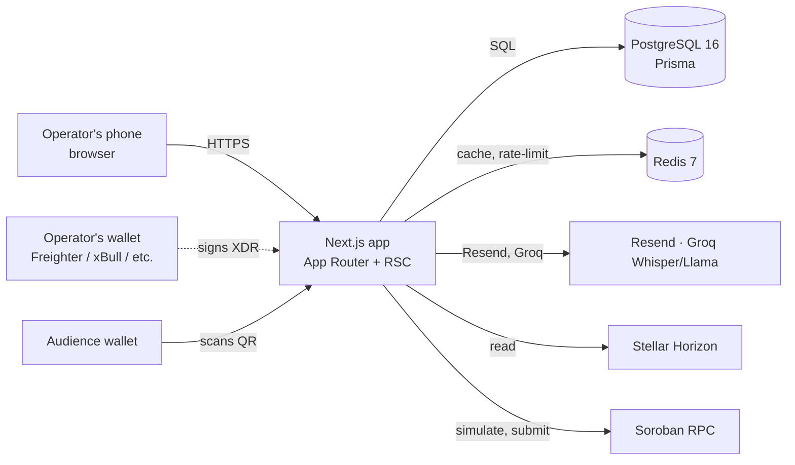
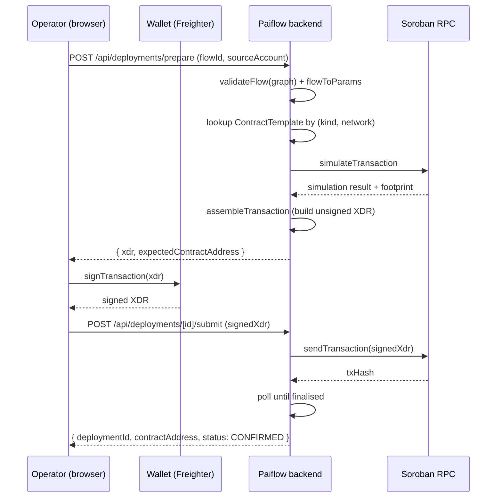
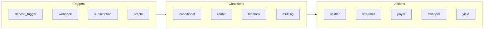

# Paiflow

**Zaps for money on Stellar.**

A visual builder for programmable payments. Drag triggers, drop actions, deploy a non-custodial Soroban contract in under a minute — without writing Rust.

| Field       | Value                                                                                                          |
| ----------- | -------------------------------------------------------------------------------------------------------------- |
| **Version** | v0.1 (living document)                                                                                         |
| **Status**  | Mainnet-ready application; contract library at 14 Rust crates; multi-contract pipelines per deployment         |
| **License** | MIT                                                                                                            |
| **Network** | Stellar / Soroban (testnet for staging, mainnet for production)                                                |
| **Custody** | Non-custodial for user funds. Optional application-owned **relayer** for automated timelock releases — see §8. |
| **Repo**    | [github.com/webnxt-2030/pinkraft](https://github.com/webnxt-2030/pinkraft) _(rebrand to `paiflow` in flight)_  |

> **Note on naming.** Paiflow was previously known as **Pink Raft** through the APAC Stellar Hackathon 2026 cycle. The product and codebase are the same; the rebrand is in flight at the time of writing.

---

## Table of contents

1. [Executive summary](#1-executive-summary)
2. [Problem](#2-problem)
3. [Solution overview](#3-solution-overview)
4. [Why Stellar and Soroban](#4-why-stellar-and-soroban)
5. [System architecture](#5-system-architecture)
6. [Contract template library](#6-contract-template-library)
7. [AI-assisted authoring (Raft Log)](#7-ai-assisted-authoring-raft-log)
8. [Security and trust model](#8-security-and-trust-model)
9. [Use-case gallery](#9-use-case-gallery)
10. [Roadmap](#10-roadmap)
11. [Team and open-source](#11-team-and-open-source)
12. [Appendix](#12-appendix)

---

## 1. Executive summary

Programmable payments are stuck behind a credentials gate. To wire up a workflow as simple as _"when this address receives USDC, split it 60/30/10 across three recipients"_ a non-developer today has two options: hire a Rust engineer who can write a Soroban contract, or rent the workflow from a closed-source SaaS that takes a cut on every flow.

**Paiflow is the missing middle layer.** It is a web application — usable on a phone — where an operator drags blocks onto a canvas (`On Receive`, `Split`, `Condition`, `On Schedule`, `Pay`), wires them together, and presses **Deploy**. The application instantiates a **pre-audited Soroban contract template** with the operator's parameters, returns a QR code, and any wallet can fund the contract from there. A live event feed animates the contract's execution as transactions finalise on-chain.

The product is **non-custodial by design**: the backend prepares simulated XDR, the user's own wallet signs, and the backend submits the signed transaction. No key material ever lands on a Paiflow server.

This v0.1 whitepaper covers the architecture, the contract template library currently in the repo (three families — **triggers**, **conditions**, **actions** — across 13 implemented crates plus a factory, with Rust unit tests on every crate), how multi-contract pipelines compose a single user-facing flow, the security posture (including the optional application-owned **relayer** that handles automated timelock releases), the AI-assisted authoring layer ("Raft Log"), and a placeholder roadmap signalling direction without committing to dates the team hasn't agreed on yet.

The ask is simple: **integrators and partners who want programmable payments on Stellar without writing or auditing their own Soroban code should treat Paiflow as their default deploy surface.**

---

## 2. Problem

Every fintech, MSME, and SMB that wants programmable payments today picks from a narrow menu:

1. **Hire a Rust developer who knows Soroban.** Rare, expensive, slow. The talent pool that ships production Soroban contracts is in the hundreds globally as of 2026. Onboarding one for a one-off payment workflow is uneconomical.
2. **Pick a closed-source SaaS.** Stripe Connect for revenue splits, dedicated streaming-payroll vendors for vesting, escrow services for milestone payouts. Each one locks the operator into someone else's rails, fees, custody, and roadmap.
3. **Do it manually.** Ad-hoc spreadsheets and weekly bank transfers. Common at the long tail, brittle, and impossible to audit.

There is no **middle layer** — no Stripe Connect for on-chain money, no Zapier for payouts — that lets a non-technical operator wire up _"when this happens, send that"_ and deploy it as their own on-chain contract.

The result: programmable payouts stay out of reach of the people who actually need them. Concrete examples we hear repeatedly:

- **Creators splitting revenue with collaborators** — a podcast host who needs to fan out monthly sponsor income across three co-hosts and an editor. Today she pays them manually from a bank account she controls.
- **OFW remittance auto-budgets** — a worker abroad who wants `${monthly_remit}` to land at home, then automatically split into `rent / savings / spending` accounts. Today she sends one transfer and relies on her family to manage the split.
- **MSME contractor pools** — a 12-person consultancy that pays freelance designers and developers per-project, where every invoice has a different split. Today the founder runs a Notion sheet and a weekly batch transfer.
- **Household budgets after income lands** — same shape as the OFW case, just domestic. The "envelope budget" pattern, but the envelopes are on-chain accounts.
- **Conditional release / milestone escrow** — a freelancer holding back 30% of project funds until a deliverable is signed off. Today, custom contracts or trusted intermediaries.

Each of these reduces to one of three primitives: **split**, **stream**, or **release-on-condition**. The pattern is small. The audience is large. The tooling gap is everything.

---

## 3. Solution overview

Paiflow is a web application with a single core loop:

1. **Drag triggers** (`On Receive`, `On Schedule`) onto a canvas.
2. **Drop actions** (`Pay`, `Split`) and optional logic (`Condition`).
3. **Wire them together** with a React-Flow canvas. Validate on every change.
4. **Press Deploy.** Paiflow's backend selects the matching Soroban template, prepares the deploy XDR with the operator's parameters, simulates it, and hands the unsigned transaction to the operator's wallet (Freighter, xBull, Albedo, Hana, LOBSTR — anything in the `@creit.tech/stellar-wallets-kit` ecosystem).
5. **Wallet signs.** Backend submits.
6. **Contract address + QR code appear.** Anyone with a wallet can scan the QR, fund the contract, and trigger its execution. A live event feed animates the contract's behaviour as transactions finalise on-chain.

### The hero demo

> A presenter, on a phone: drags `On Receive USDC` → `Split 60/30/10` → `[Alice, Bob, Charlie]`. Hits **Deploy**. QR code appears on the projector. Audience member scans, sends 10 testnet USDC. Within ~5 seconds three transactions fan out on the Stellar explorer, also projected.

The whole arc, from a blank canvas to live on-chain fan-out, is **under 90 seconds**.

### What makes it different

- **Pre-audited templates, not arbitrary Soroban.** Paiflow is not a Soroban IDE. It ships a curated library of contract templates that cover the long tail of real-world payment workflows. Each template is open-source, unit-tested in Rust, and parameterised — operators choose values, not behaviour. The trust model is "audit the template once, deploy it a million times."
- **Non-custodial all the way down.** The backend never holds a Stellar secret key. Every transaction is signed by the operator's own wallet. If Paiflow disappeared tomorrow, every deployed contract would keep working and every operator would keep their funds.
- **AI-assisted authoring.** A built-in chat panel ("Raft Log") accepts plain English ("change Alice to 55%") or voice ("add a recipient called Bob at thirty percent"). The AI emits a JSON patch that goes through the same validator as any other edit. The user reviews and applies.
- **Public QR / dApp trigger flow.** Every deployed contract gets a shareable QR that opens a public trigger page. Any wallet can fund and execute. Useful for audience-funded demos, crowdpay flows, and self-test fund-backs.
- **Mobile-first.** The hero demo is on a phone. The builder is responsive. If a flow can't ship from a phone, we haven't solved the problem.

---

## 4. Why Stellar and Soroban

Paiflow's design is opinionated about the chain. Stellar plus Soroban is the right home for this product for five concrete reasons.

**1. Atomic transfers as a first-class primitive.** Stellar has had multi-operation atomic transactions since day one. Splitting an incoming payment into three outgoing payments is a single atomic transaction at the protocol level. On chains where multi-recipient sends are a smart-contract pattern bolted onto a single-asset transfer primitive, the same workflow is fragile and expensive. On Stellar, it's idiomatic.

**2. Low fees and fast finality.** Stellar's base fee is fractions of a cent and ledger close time is ~5 seconds. The unit economics of "splitting $10 across three recipients" are favourable; on chains with higher gas or longer finality, the same flow doesn't work for small-value real-world payouts.

**3. SEP-7 deep links.** [SEP-7](https://github.com/stellar/stellar-protocol/blob/master/ecosystem/sep-0007.md) is Stellar's standard URI scheme for payment intents (`web+stellar:tx?xdr=…`). Every Soroban-aware wallet in the ecosystem understands it. Paiflow's QR trigger flow rides on this standard rather than inventing its own — scan the QR, the wallet recognises the URI, the user signs.

**4. Soroban host-function maturity.** Soroban exposes a rich host function surface: storage with TTL, cryptography, event emission, and most importantly **cross-contract calls** and **Stellar Asset Contract (SAC)** interop. The SAC means a Paiflow splitter contract can transfer USDC, XLM, or any other Stellar-native asset using the same `token::Client::transfer` interface. We don't have to reimplement asset handling per token.

**5. Multi-wallet ecosystem with a shared adapter.** [`@creit.tech/stellar-wallets-kit`](https://github.com/Creit-Tech/Stellar-Wallets-Kit) gives us first-class integration with Freighter, xBull, Albedo, Hana, and LOBSTR through a single API. The operator picks their wallet; Paiflow doesn't care which one. On chains where wallet integration is per-wallet bespoke code, supporting five wallets is five projects. On Stellar via this kit, it's one.

What we are **not** claiming: that Stellar is "the future of money" or "the best chain for X." We're claiming that for the specific shape of product Paiflow is — small-value, multi-recipient, fast-finality, asset-agnostic programmable payments — Stellar is the right home.

---

## 5. System architecture

Paiflow is a conventional three-tier web application with a Stellar layer bolted on. Nothing exotic.

### 5.1 Frontend

- **Next.js 15** App Router with React 19 Server Components and Server Actions.
- **Tailwind 4** + `shadcn/ui` for the component primitives.
- **`@xyflow/react`** for the drag-drop canvas — Paiflow's headline UI.
- **`zustand`** for client canvas state, **TanStack Query** for server state, **react-hook-form + zod** for forms with type-safe validation.
- **`framer-motion`** for canvas animations (edges pulse when on-chain events arrive).
- **Mobile-responsive** — the builder works on a 414px viewport, and the trigger page is phone-first by design.

### 5.2 Backend

- Next.js **Route Handlers** for the API surface. Everything mutating goes through a shared `withErrorHandler` wrapper that normalises responses into a discriminated `{ data }` / `{ error: { code, message } }` envelope.
- **PostgreSQL 16** via Prisma 6 for the relational store: users, flows, deployments, contract events, audit log, address book.
- **Redis 7** (`ioredis`) for rate-limiting on public endpoints and for short-lived cache entries. Optional in dev — the rate-limiter falls back to an in-memory bucket when Redis is unavailable.
- **Auth.js v5** (`next-auth`) with the Prisma adapter for credentials sessions, plus optional WebAuthn second factor via `@simplewebauthn`.
- Optional **Resend** for transactional email (password reset) and optional **Groq** for the Raft Log AI features. When the API keys are unset, both gracefully degrade: emails log to stdout, AI features show a disabled state.

### 5.3 Stellar layer

- **`@stellar/stellar-sdk`** for Horizon reads, Soroban RPC reads, and transaction-builder writes.
- **`@creit.tech/stellar-wallets-kit`** for the wallet adapter (Freighter, xBull, Albedo, Hana, LOBSTR).
- **Network pinned per environment.** There is no in-app network picker. A single `STELLAR_NETWORK` env var (`testnet` or `mainnet`) is set once per environment (staging = `testnet`, production = `mainnet`). The deploy review UI shows a read-only chip; the prepare endpoint refuses to accept a network parameter. This eliminates a whole class of "wrong network on prod" bugs. See [`docs/mainnet-cutover.md`](../mainnet-cutover.md) for the operator runbook.

### 5.4 The deploy flow

The non-custodial deploy is the load-bearing piece. A single user-facing flow can compose into a **pipeline of multiple Soroban contracts** (e.g. a timelock condition wired into a splitter action). The deploy step instantiates each contract in order, wires their addresses together via constructor parameters, and records the full chain in `Deployment.pipelineSnapshot` so the live event feed, the trigger flow, and the cron relayer all share one consistent view.

End to end, for a single-contract pipeline:

The wallet is the only thing in the loop that holds a secret key. The backend's role is to construct, simulate, and assemble the XDR — never to sign it. If Paiflow is compromised tomorrow, the worst-case impact is "the next deploy might prepare a malicious XDR" — which the wallet would still show to the user before signing, with the contract address and parameters visible.

### 5.5 The trigger flow

Every deployed contract gets a public **trigger page** at `/trigger/[deploymentId]` and a corresponding QR code. The flow:

1. Audience member scans the QR with their wallet's camera.
2. The wallet opens the trigger page.
3. The page calls `POST /api/deployments/[id]/trigger` (public, rate-limited, audit-logged) with `{ amount, userAddress }`. The backend simulates a `distribute(from, amount)` invocation against the deployed contract and returns an unsigned XDR.
4. The audience wallet signs.
5. `POST /api/deployments/[id]/submit-trigger` submits the signed XDR and polls for finality.

The owner of the deployment never signs anything during the trigger flow. The audience member's keys never leave their wallet. The Paiflow backend only ever sees unsigned simulation input and signed bytes for submission.

### 5.6 Live event feed

The deployment page shows a live, on-chain event feed: every `RECEIVE`, `PAYOUT`, `CLAIM`, and `CANCEL` emitted by the contract appears in a chronological list, with new events sliding in from the top. The canvas edges pulse when a payment fans out.

The implementation is intentionally simple. The page polls `GET /api/deployments/[id]/poll-events` at a configurable interval (default 1 second, single constant `POLL_EVENTS_INTERVAL_MS` in `lib/deployments/constants.ts`). The endpoint fetches new events from Soroban RPC since the last cursor, persists them as `ContractEvent` rows in Postgres, and returns the merged set. The client dedupes by event id / txHash and caps the visible list at 100 entries.

Earlier iterations of this stack used Server-Sent Events fanned out from a Redis pub/sub queue populated by a background worker. We removed both. The current page-level RPC poll is **one moving part**, has no global background process, and is trivially debuggable — open the Network tab, watch the requests. The trade-off is ~1 second of latency vs. the previous near-instant SSE delivery. For the product's actual use case (a human watching a phone), 1 second is invisible.

### 5.7 The relayer (optional, opt-in)

Some templates — most notably **timelock** — need a transaction to fire _after_ a wall-clock event, with no human at the keyboard. To support that without weakening the non-custodial guarantee, Paiflow has an optional **relayer** path.

- The relayer is an **application-owned Stellar account**, configured via `STELLAR_RELAYER_SECRET_KEY`. When the env var is unset, no relayer path exists at all.
- A cron endpoint (`POST /api/cron/auto-release`, gated by `CRON_SECRET`) walks `CONFIRMED` deployments, finds any nodes in the pipeline whose `templateKind === "TIMELOCK"`, and invokes a single contract function — `release_by_relayer()` — on each. Nothing else.
- The contract itself enforces the scope. `release_by_relayer` is admission-controlled to the relayer address recorded at deploy time, and it can only release funds to the recipient that was wired into the timelock at construction. The relayer cannot transfer arbitrary funds, change recipients, or call any other contract function.
- Users who don't want a relayer-released timelock can deploy the same contract with the admin address as the relayer; the cron walks past those without action.

The implication for the security model is covered honestly in §8.1. The short version: the backend holds **one** key (the relayer), and that key has been scoped by contract logic to do exactly **one** thing.

---

## 6. Contract template library

The contract library is the headliner. Paiflow's value is concentrated here — the templates determine which real-world workflows the product can express. Everything else in the codebase is in service of getting users to a deployed, parameterised instance of one of these contracts.

The library is organised into three families that compose:

The composition is **literal**, not just mental — `Deployment.pipelineSnapshot` (see §5.4) records the chain of `(nodeId, contractAddress, templateKind)` entries that compose the user's flow, and each entry is a standalone Soroban contract instance with constructor parameters wired to its upstream neighbour. The grouping into trigger / condition / action mirrors the role each contract plays in a real-world workflow: something fires, optionally we check whether to act, then funds move.

### Status of each crate

All 14 crates listed below have Rust source under `contracts/`, compile with `soroban-sdk = 26.0.0` to `wasm32v1-none`, and have inline Rust unit tests (`cargo test --workspace`).

**Status reflects how exposed each template is through the Paiflow builder UI and deploy pipeline**, not the maturity of the underlying contract code:

- **Shipped (v1)** — surfaced in the builder, deployable end-to-end through the app, has a live event decoder for the feed.
- **In design** — Rust crate exists and is tested; builder support and the full deploy/feed pipeline are being wired through incrementally.

| Family    | Template        | Status     | Purpose                                                                                                                      |
| --------- | --------------- | ---------- | ---------------------------------------------------------------------------------------------------------------------------- |
| Action    | **splitter**    | Shipped    | Atomic BPS-weighted fan-out across N recipients. The canonical 60/30/10 case.                                                |
| Action    | **streamer**    | Shipped    | Time-based linear vesting / streaming. Recipients claim accrued balance.                                                     |
| Action    | **payer**       | Shipped    | Pays a configured recipient. Two amount modes: **fixed amount** (exact stroops) or **percentage** of the contract's balance. |
| Condition | **conditional** | Shipped    | Release-on-condition escrow. `amount_gt` / `amount_lt`, `time_after` / `time_before`, oracle-attested gates.                 |
| Condition | **timelock**    | Shipped    | Delays the downstream action until a wall-clock time. Auto-released via the optional relayer cron (see §5.7).                |
| Trigger   | deposit_trigger | In design  | Fires the downstream chain when a deposit lands above a threshold.                                                           |
| Trigger   | webhook         | In design  | HTTP-callable trigger that emits an on-chain event recordable by Paiflow's feed.                                             |
| Trigger   | subscription    | In design  | Recurring pull, opt-in by the payer, with grace-period handling.                                                             |
| Trigger   | oracle          | In design  | Reads a price / data feed to gate downstream conditions.                                                                     |
| Condition | router          | In design  | Branches to one of N downstream actions based on input shape.                                                                |
| Condition | multisig        | In design  | Requires N-of-M approvals from a configured signer set.                                                                      |
| Action    | swapper         | In design  | Routes through Stellar DEX / SDEX or AMM to convert assets before action.                                                    |
| Action    | yield           | In design  | Deposits idle balance into a yield primitive (research-stage; integration partner TBD).                                      |
| Factory   | factory         | Scaffolded | Single-tx deploy + initialise pattern that other templates will register against (in design).                                |

### Why three families that compose

The three-family split mirrors how operators actually describe what they want. "When [trigger], if [condition], do [action]." Almost every real-world payment workflow we hear can be decomposed into one of each. The library's long-term goal is that **the most common 80% of programmable-payment workflows are expressible by combining one shipped trigger, one shipped condition, and one shipped action.**

### Audit posture

Every contract crate is open source under MIT, lives in the same repo as the application, and has inline Rust unit tests run by CI on every push (`cargo fmt --all --check`, `cargo clippy --all-targets -D warnings`, `cargo test --workspace`). The hardened, deploy-surfaced templates (splitter, streamer, payer, conditional, timelock) are the v1 audit target. A formal third-party audit pass is a near-term roadmap item; until that lands, treat the v1 templates as "open-source, unit-tested, reviewed by the team" rather than "third-party audited."

The `factory` crate is the planned single-tx deploy-and-initialise pattern that will let the application instantiate any registered template through one Soroban call. It's scaffolded in the workspace; full integration is in design.

### Constructor parameters and event surface

Detailed per-template constructor signatures, event topics, and decoded data shapes live in [`docs/soroban-smart-contracts.md`](../soroban-smart-contracts.md). The whitepaper deliberately doesn't duplicate that surface — `SPEC.md` and the contract source are the engineering source of truth.

---

## 7. AI-assisted authoring (Raft Log)

Building a flow visually is fast for the second one you ever build. The first one is intimidating. The Raft Log is a chat panel docked to the right of the builder that lets the operator skip the learning curve by typing or speaking what they want.

### Two modes

- **Chat mode.** "What does this flow do?" / "Why is the deploy button disabled?" / "What's the difference between a splitter and a streamer?" The AI explains. It does not modify the flow.
- **Patch mode.** "Add a recipient called Bob at 30%." / "Change Alice to 55%." / "Make this a streamer instead of a splitter, vesting over 30 days." The AI emits a structured JSON patch that gets validated against the same flow schema as any other edit. The user reviews the diff and applies — or rejects — the patch. The AI never silently mutates state.

The mode is selected by the model based on the user's intent, and the system prompt is explicit about when to ask a clarifying question rather than guess (e.g. when multiple recipients are named "Alice" or when an asset is ambiguous).

### Voice input

The chat panel also accepts voice. The browser captures audio via `MediaRecorder`, the resulting blob is uploaded to a Paiflow endpoint, and the endpoint forwards it to **Groq Whisper** (`whisper-large-v3` with fallback to `whisper-large-v3-turbo` on rate-limit or upstream failure). The transcribed text is dropped into the chat input; the user reviews and sends. The voice path is opt-in (you have to click the mic), per-user rate-limited (20 transcribe requests per 10 minutes), and gated by the browser microphone permission.

We removed an earlier experiment that ran the browser's built-in `webkitSpeechRecognition` API for live preview, because that path silently dual-routes the user's voice to Google's or Apple's cloud STT services — a disclosure gap for a product that touches wallet addresses. The current voice flow uses only Groq; nothing leaves Paiflow's infrastructure except the audio bytes the user explicitly recorded.

### Model selection

The default text model is **Llama 4 Scout** (`meta-llama/llama-4-scout-17b-16e-instruct`), served via Groq for low latency. A pluggable OpenAI-compatible fallback exists via `AI_API_KEY` / `AI_BASE_URL` / `AI_MODEL` env vars so an operator with their own provider (Together, OpenRouter, a local server) can swap in.

### Security posture

The Raft Log endpoints sit behind the same auth, rate-limit, and audit-log discipline as the rest of the application. Every transcription and AI invocation is owner-only — there is no public AI surface — and rate-limited per user. JSON patches emitted by the AI are validated server-side against the same Zod schema as any other flow edit; a malformed or unsafe patch is rejected before it touches the database. The AI cannot bypass the validator.

---

## 8. Security and trust model

The product's security story has three pillars: **key custody** (none for user funds; one scoped application key for automated timelock releases — see below), **app auth** (defence in depth), and **public-endpoint hardening** (rate-limit + audit-log everywhere).

### 8.1 Key custody

**For user funds, Paiflow never sees a Stellar secret key.** Not in the database, not in environment variables, not in logs, not in transit. The rule, repeated in `AGENT.md` for every coding agent that touches the codebase: _the backend may build and submit transactions, but never signs user transactions._

Concretely, for every operator-initiated and audience-initiated flow:

- Every Soroban transaction is constructed and simulated server-side, then handed to the user's wallet as an unsigned XDR.
- The wallet signs locally (in a browser extension or a hardware-backed module, depending on which wallet).
- The signed XDR comes back to the backend, which submits it via Soroban RPC.
- If a code path that signs on behalf of a _user_ ever appears in a PR, it is rejected on review.

This means: if the Paiflow application is breached tomorrow, the attacker cannot move user funds. They can prepare malicious XDR for the next user to deploy, but the wallet would surface the contract address and parameters before signing — the user is the last line of defence and they actually see what they're signing.

#### The one exception: the relayer

The product needs to call `release_by_relayer()` on timelock contracts after a wall-clock event passes, with no user at the keyboard (see §5.7). To do that without faking custody, Paiflow optionally holds **one** Stellar account — the **relayer** — configured via `STELLAR_RELAYER_SECRET_KEY`. This is honest about what it is:

- **One key, one purpose.** The relayer key signs only `release_by_relayer()` invocations against timelock contracts that recorded its address at construction. No other call. No other contract type.
- **The contract enforces the scope.** Authorisation is gated by the Soroban contract itself (`require_auth` against the stored relayer address). The relayer cannot transfer arbitrary funds, change recipients, or call any other contract function. A breach of the relayer key lets the attacker release a timelock _to the recipient already configured at deploy time_ — i.e. they can grief by triggering an early release that would have happened later anyway. They cannot redirect funds.
- **Opt-in per deployment.** A user who doesn't want a relayer can deploy the same template with the admin address as the relayer; the cron walks past those without action.
- **Opt-out per environment.** When `STELLAR_RELAYER_SECRET_KEY` is unset, the cron returns early and no relayer transaction is ever built or signed.
- **Standard key hygiene.** The relayer key is treated as a Railway secret (env var, never logged), funded with just enough XLM to pay fees, and rotatable (deploy contracts with a new relayer address, decommission the old).

We chose this over a fully trustless alternative (e.g. user-paid `release()` calls) because timelock's whole value proposition is "I don't have to remember to claim." A trustless `release()` re-introduces the operational burden the contract was meant to remove.

### 8.2 App auth

- **Password hashing.** `argon2id` with conservative parameters (memory 19 MiB, time cost 2, parallelism 1). No bcrypt, no SHA fallback.
- **Optional WebAuthn second factor.** `@simplewebauthn` server + browser. Passkeys are first-class.
- **Password reset.** SHA-256-hashed tokens stored in the database (raw token only travels in the email link), TTL 60 minutes, single-use, invalidated on use. Reset completion wipes all the user's sessions in a single transaction so any stale device must re-authenticate.
- **HIBP-pwned-password check.** Optional, gated by `HIBP_CHECK_ENABLED`. When on, new passwords are k-anonymised against haveibeenpwned.com's API before acceptance.
- **Rate-limiting** on every authentication endpoint, with both per-IP and per-username buckets to make credential-stuffing and targeted-account attacks expensive in different ways.
- **Audit log** for every security-sensitive action: login, login failure, lockout, password change, password reset request, password reset complete, session revoke, role change.

### 8.3 Public-endpoint hardening

The public trigger flow (`/api/deployments/[id]/trigger` and `/submit-trigger`) is intentionally unauthenticated — that's the point. But "unauthenticated" doesn't mean "unprotected":

- **Per-IP rate-limit** on both endpoints (default 20 requests / minute / IP per deployment), backed by Redis with an in-memory fallback.
- **`DEPLOY_TRIGGER` audit-log entry** on every successful trigger so abuse is forensically traceable.
- **Strict input validation.** `userAddress` is checked with `StrKey.isValidEd25519PublicKey` at the boundary — a malformed key fails with a clear 422, not a cryptic RPC error.
- **`Permissions-Policy` header** sets `microphone=(self)`, plus restrictive defaults on camera / geolocation / payment.
- **Content Security Policy** with a per-request nonce, strict `connect-src`, and explicit allow-list for the wallet provider relays (WalletConnect, etc.).
- **`Referrer-Policy: no-referrer`** on pages that carry sensitive query-string tokens (e.g. password-reset consume).

### 8.4 What we are not claiming

- We are **not claiming a third-party formal audit** of the contract templates. The v1 templates are open-source, unit-tested in Rust, and reviewed by the team. A formal audit is a near-term roadmap item.
- We are **not claiming bug-bounty coverage** at the time of writing.
- We are **not claiming HSM-backed key custody on the server**, because we don't custody keys at all.

For any of those that becomes a partner gate, file an issue.

---

## 9. Use-case gallery

Six concrete workflows that map cleanly to the v1 template library.

### 9.1 Creator revenue split (Splitter)

A podcast producer signs a sponsor deal. Income lands monthly in USDC. She wants 60% to herself, 30% to her co-host, 10% to the editor.

She drags `On Receive USDC` → `Split` onto the canvas, adds three recipients, presses Deploy. The contract address becomes the sponsor's `pay to` address. Every month, when the sponsor pays the contract, three payouts fan out atomically. The producer never touches the money in between.

### 9.2 OFW remittance auto-budget (Splitter)

A worker abroad sends $1,000/month home. Her family budget is `60% household / 25% savings / 15% her teenage son's school account`.

She deploys a splitter contract once, gives her employer the contract address as her "salary" target, and the split happens on-chain every payday. She gets receipts via the public deployment page. If she wants to change the percentages, she deploys a new contract — and points the salary at the new address. No middleman, no monthly manual ops.

### 9.3 Freelance contractor payroll (Splitter, per-project)

A 12-person consultancy. Every project has a different bill rate and a different team split. The founder spins up one splitter contract per project, drops the contract address in the project invoice, and the client pays the contract. Payouts to designers and developers fan out atomically when the client transfers in. No spreadsheet, no batch transfer, every recipient can audit the contract themselves on stellar.expert.

### 9.4 Vesting for a contractor (Streamer)

A startup grants a fractional CTO a six-month engagement with $10k/month vesting linearly. They deploy a streamer contract with the contractor as the recipient, fund it once with $60k, and the contractor can claim accrued balance any time during the six months. No HR pipeline, no recurring transfer setup. The contract enforces the schedule.

### 9.5 Milestone escrow (Conditional)

A freelance designer is hired for a logo project, $5k flat. The client holds back 30% until sign-off. They deploy a conditional contract that releases the $1.5k holdback on a condition (oracle-attested or time-based). The designer can see the contract, audit its release condition, and trust the chain rather than the client's intent to wire later.

### 9.6 Audience-funded crowdpay (QR trigger)

A live demo or a fundraiser. The presenter deploys a splitter (60% charity A, 30% charity B, 10% gas), QR-codes the trigger URL, projects it on the screen. Audience members scan and contribute. Every contribution fans out atomically; the live feed updates within ~1 second. The total raised is the on-chain contract balance, visible to everyone in the room.

---

## 10. Roadmap

> **v0.1 status:** placeholder. The detailed roadmap is being finalised by the team and will land in a follow-up revision of this whitepaper. The themes below describe direction, not dated commitments.

### Near-term themes

- **Template library expansion.** Promote in-design crates from the `contracts/` workspace through the builder, deploy pipeline, and event feed, one at a time. Specific templates and ordering are TBD.
- **Mainnet GTM.** Move beyond testnet for production users. Pricing, support model, partner SLAs, and operator onboarding flow are TBD.
- **Integrator surface.** A first-class story for partners building on top of Paiflow templates: a small SDK, hosted sandbox, integration docs. Scope and shape TBD.
- **Third-party contract audit.** Engage a Soroban-experienced auditor for the v1 shipped templates (splitter, streamer, conditional). Timing TBD.

### Researching

- Items the team is actively evaluating but has not yet committed to shipping. _To be filled in as decisions are made._

### Explicitly out of scope

- **No Paiflow token.** The product does not need one; introducing one would create regulatory and economic complexity that's antithetical to the "credible neutral infrastructure" positioning.
- **No cross-chain expansion in the near term.** Stellar / Soroban only. Doing one chain well is the constraint; multi-chain support is a different product.
- **No on-chain governance / DAO.** The contract library is open-source under MIT; downstream forks are welcome and unencumbered.

_This section will be replaced with a concrete roadmap in a follow-up revision once the team locks priorities and timing._

---

## 11. Team and open-source

Paiflow is built by a small distributed team and was originally shipped as a hackathon submission to the APAC Stellar Hackathon 2026. Active contributor handles are visible on the [repository contributors page](https://github.com/webnxt-2030/pinkraft/graphs/contributors); detailed team-member names and roles will be filled in as part of finalising this whitepaper.

The entire codebase is **MIT-licensed** and open source. That includes:

- The Next.js application (frontend + backend).
- All Soroban contract crates under `contracts/`.
- The infrastructure scaffolding (Prisma schema, Docker compose, Railway config, CI workflows).
- Documentation including `SPEC.md`, `AGENT.md`, `BRAND.md`, the running feature changelog, and this whitepaper.

### Governance

Paiflow uses a **benevolent maintainer** model for v0.1. PRs are reviewed by the core team; substantive direction changes go through GitHub issues for visibility before being implemented. There is no on-chain governance, no token-weighted voting, no DAO; we don't think those mechanisms add value for an open-source application of this size yet.

### Contributing

External contributions are welcome. The repo's branching model is documented in [`README.md`](../../README.md): short-lived feature branches → `develop` → `staging` → `main`. CI must be green (node + rust lanes) before merge. The engineering conventions in `AGENT.md` apply to every PR.

---

## 12. Appendix

### Repository and documentation

- [`README.md`](../../README.md) — quick-start, run-locally, scripts, env vars, branching, deployment.
- [`SPEC.md`](../../SPEC.md) — the full internal engineering specification (~1k lines). Source of truth for implementation detail.
- [`AGENT.md`](../../AGENT.md) — engineering conventions and mental model for agents and humans working on the codebase.
- [`BRAND.md`](../../BRAND.md) — visual system and voice (a Paiflow-rebranded refresh is in flight).
- [`docs/features.md`](../features.md) — running changelog of user-visible features.
- [`docs/soroban-smart-contracts.md`](../soroban-smart-contracts.md) — Soroban primer + Paiflow-specific contract notes.
- [`docs/mainnet-cutover.md`](../mainnet-cutover.md) — operator runbook for the testnet → mainnet transition.

### External references

- [Stellar.org](https://stellar.org) — protocol home.
- [Soroban documentation](https://developers.stellar.org/docs/build/smart-contracts) — host functions, contract authoring.
- [SEP-7](https://github.com/stellar/stellar-protocol/blob/master/ecosystem/sep-0007.md) — payment URI scheme used by Paiflow's QR trigger flow.
- [stellar.expert](https://stellar.expert) — block explorer; every contract address in the Paiflow UI links to the corresponding `testnet` / `public` page.
- [`@stellar/stellar-sdk`](https://github.com/stellar/js-stellar-sdk) — JS SDK Paiflow's backend uses.
- [`@creit.tech/stellar-wallets-kit`](https://github.com/Creit-Tech/Stellar-Wallets-Kit) — wallet adapter Paiflow's frontend uses.

### Deployed contract addresses

- **Testnet.** Filled in per `pnpm contracts:upload --network=testnet`. See the dashboard NETWORK card in the running application for live values.
- **Mainnet.** Filled in per the `docs/mainnet-cutover.md` runbook once each template clears the audit gate.

### Pitch deck

A short visual companion to this whitepaper lives in two forms:

- [`docs/pitch-deck.md`](../pitch-deck.md) — the current MARP-based investor deck (Markdown-source, renderable as slides via [Marp](https://marp.app/)).
- [`docs/PinkRaft-PitchDeck.pdf`](../PinkRaft-PitchDeck.pdf) — the previous Pink Raft-branded PDF, retained for archival reference until the rebrand fully lands.

### Living changelog

This whitepaper is versioned with the code. Substantive edits since the first draft:

- **v0.1 r2** — added §5.7 (relayer + cron auto-release path), §6 promoted `payer` and `timelock` to shipped (so v1 set is now splitter / streamer / payer / conditional / timelock), §8.1 rewritten to be honest about the optional relayer key and the contract-enforced scope that limits its blast radius, multi-contract pipeline framing added to §5.4 (`pipelineSnapshot`), and the §6 mermaid family diagram now includes `payer`.
- **v0.1 r1** — initial draft.

---

_Paiflow whitepaper v0.1 · maintained in [the project repository](https://github.com/webnxt-2030/pinkraft) · MIT-licensed._
